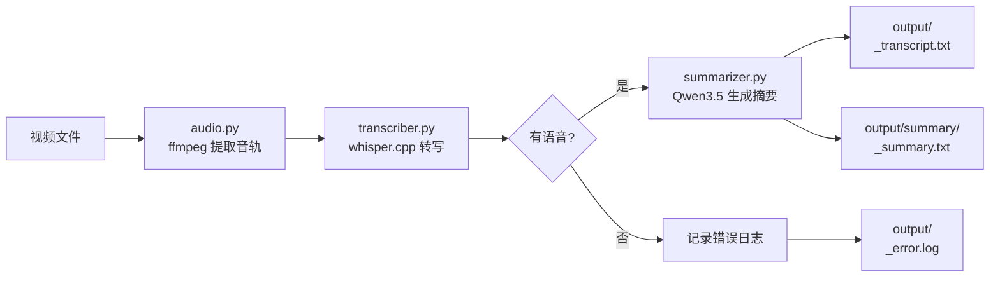
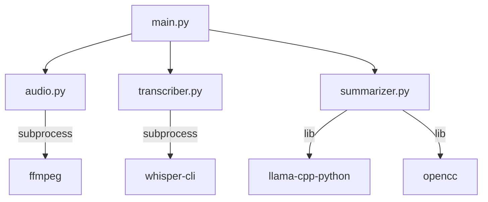
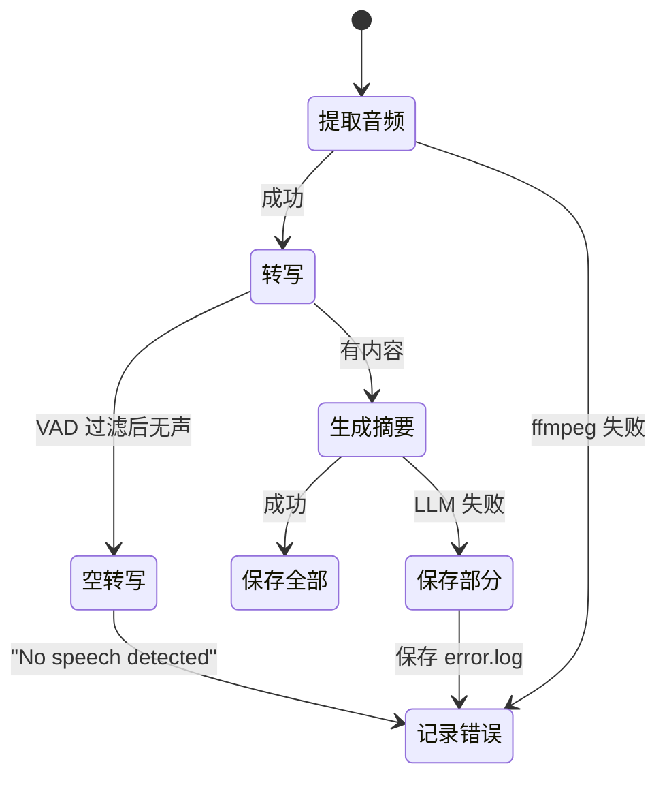

# Video2Text 设计文档

## 概述

Video2Text 是一个 Python CLI 工具，将视频转换为文字稿和内容简介。支持单文件和批量处理，采用 GPU 加速。



## 用户故事

1. 作为用户，我想要通过命令行传入视频路径，以便快速处理单个视频文件
2. 作为用户，我想要传入一个目录路径，以便批量处理多个视频文件
3. 作为用户，我想要指定输出目录，以便将结果保存到指定位置
4. 作为用户，我想要指定 LLM 模型路径，以便使用自定义的本地模型
5. 作为用户，我希望转写使用中文语言设置，以提高中文转写的准确度
6. 作为用户，我希望在有 GPU 时自动使用 GPU 加速转写和推理
7. 作为用户，我希望能看到处理进度，以便了解当前处理状态
8. 作为用户，我希望在详细模式下看到步骤耗时、文件大小等信息
9. 作为用户，我希望转写成功时即使摘要失败也能保存转写文本
10. 作为用户，我希望程序自动清理临时音频文件
11. 作为用户，我希望程序能自动跳过已处理的视频，避免重复处理
12. 作为用户，我希望能使用 VAD 过滤无人声的视频，避免 hallucination
13. 作为用户，我希望所有输出使用简体中文

## 架构



| 模块 | 职责 | 外部依赖 |
|------|------|----------|
| `main.py` | CLI 入口、参数解析、流程编排 | tqdm |
| `audio.py` | 音频提取 (16kHz mono PCM WAV) | ffmpeg |
| `transcriber.py` | 语音转写，调用 whisper.cpp CLI | whisper-cli, silero VAD |
| `summarizer.py` | LLM 摘要生成，opencc 简繁转换 | llama-cpp-python, opencc |

## CLI 接口

```bash
python main.py <input> [选项]
```

| 参数 | 默认值 | 说明 |
|------|--------|------|
| `input` | *(必填)* | 视频文件或目录 |
| `-o/--output` | `./output/` | 输出目录 |
| `-m/--model` | `models/qwen3.5-4b-instruct-Q4_K_M.gguf` | LLM 模型路径 |
| `--whisper-model` | `models/ggml-medium-q8_0.bin` | Whisper 模型路径 |
| `--whisper-cli` | `/tmp/whisper.cpp/build/bin/whisper-cli` | whisper-cli 二进制路径 |
| `--vad-model` | `models/ggml-silero-v5.1.2.bin` | VAD 模型路径 |
| `--no-vad` | false | 禁用 VAD 过滤 |
| `--no-speech-thold` | `0.6` | 无人声阈值 (0.0-1.0) |
| `-f/--force` | false | 强制重新处理 |
| `-v/--verbose` | false | 详细日志 |

### 使用示例

```bash
# 处理单个视频
python main.py video.mp4

# 批量处理目录
python main.py videos/

# 指定输出目录并查看详细日志
python main.py videos/ -o my_output -v

# 强制重新处理
python main.py video.mp4 --force
```

## 处理流程

```mermaid
sequenceDiagram
    participant U as 用户
    participant M as main.py
    participant A as audio.py
    participant T as transcriber.py
    participant S as summarizer.py

    U->>M: python main.py <input>
    M->>M: 解析参数，收集视频列表
    loop 每个视频
        M->>M: 检查输出是否已存在
        alt 已存在且非 --force
            M->>M: 跳过
        else 需要处理
            M->>A: extract_audio(video)
            A->>A: ffmpeg -i video -vn -ar 16000 -ac 1 output.wav
            A-->>M: audio.wav
            M->>T: transcribe(audio, model, vad)
            T->>T: whisper-cli + VAD → 中文转写
            T-->>M: transcript
            alt transcript 为空
                M->>M: 记录 "No speech" 错误
            else transcript 有内容
                M->>S: summarize(transcript)
                S->>S: Qwen3.5 生成摘要
                S->>S: opencc 繁→简转换
                S-->>M: summary
                M->>M: 保存 transcript.txt + summary.txt
            end
        end
    end
    M-->>U: 统计: 成功/失败/跳过
```



## 错误处理



| 场景 | 行为 |
|------|------|
| 音频提取失败 | 记录错误，继续下一视频 |
| 转写为空 (无人声) | 记录 "No speech detected"，继续 |
| 摘要生成失败 | 仍保存 transcript，记录 summary 错误 |
| 转写超长 (>10000字符) | 自动截断后生成摘要 |
| 程序异常退出 | 临时音频由文件系统回收 |

## 技术选型

| 环节 | 方案 | 详情 |
|------|------|------|
| 音频提取 | ffmpeg | 16kHz / mono / PCM 16-bit WAV |
| 语音转写 | whisper.cpp | GGML medium-q8_0, 语言=zh, CUDA 加速 |
| VAD 过滤 | silero VAD | v5.1.2 GGML, 阈值 0.6 |
| 摘要生成 | llama-cpp-python | Qwen3.5 4B Q4_K_M, ctx=16384 |
| 简繁转换 | opencc | t2s 配置，摘要生成后自动转换 |
| 进度显示 | tqdm | 处理进度条 |

### LLM 推理参数

| 参数 | 值 | 说明 |
|------|-----|------|
| `max_tokens` | 2048 | 最大生成 token 数 |
| `temperature` | 0.7 | 采样温度 |
| `top_p` | 0.8 | 核采样 |
| `top_k` | 20 | Top-K 采样 |
| `presence_penalty` | 1.5 | 重复惩罚 |
| `repeat_penalty` | 1.0 | 重复惩罚 |
| `n_ctx` | 16384 | 上下文窗口 |

## 目录结构

```
video2text/
├── main.py              # CLI 入口
├── audio.py             # 音频提取
├── transcriber.py       # 语音转写
├── summarizer.py        # 摘要生成
├── pyproject.toml       # 项目配置
├── AGENTS.md
├── docs/
│   └── design.md
├── models/              # 模型文件（需自行下载）
│   ├── qwen3.5-4b-instruct-Q4_K_M.gguf
│   ├── ggml-medium-q8_0.bin
│   └── ggml-silero-v5.1.2.bin
└── output/              # 默认输出目录
    ├── *_transcript.txt
    └── summary/
        └── *_summary.txt
```

## 已知限制

- 仅支持中文语音转写
- 无人声或纯背景音乐视频会被 VAD 过滤
- LLM 上下文窗口 16384 tokens，超长转写截断至 10000 字符
- 需要本地模型文件（约 3.4GB）：Qwen GGUF + Whisper GGML + Silero VAD
- whisper.cpp 需使用 CUDA 编译以获得 GPU 加速：`cmake -B build -DGGML_CUDA=on`

## 后续方向

- 多语言转写支持
- 自定义 LLM prompt
- 更多输出格式 (JSON, Markdown, SRT)
- 断点续传
- Web UI