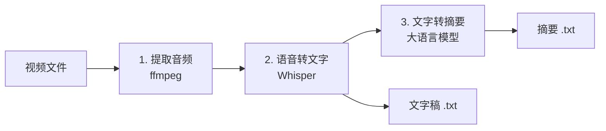
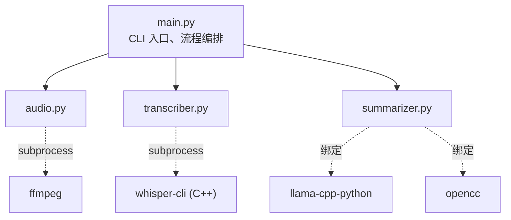
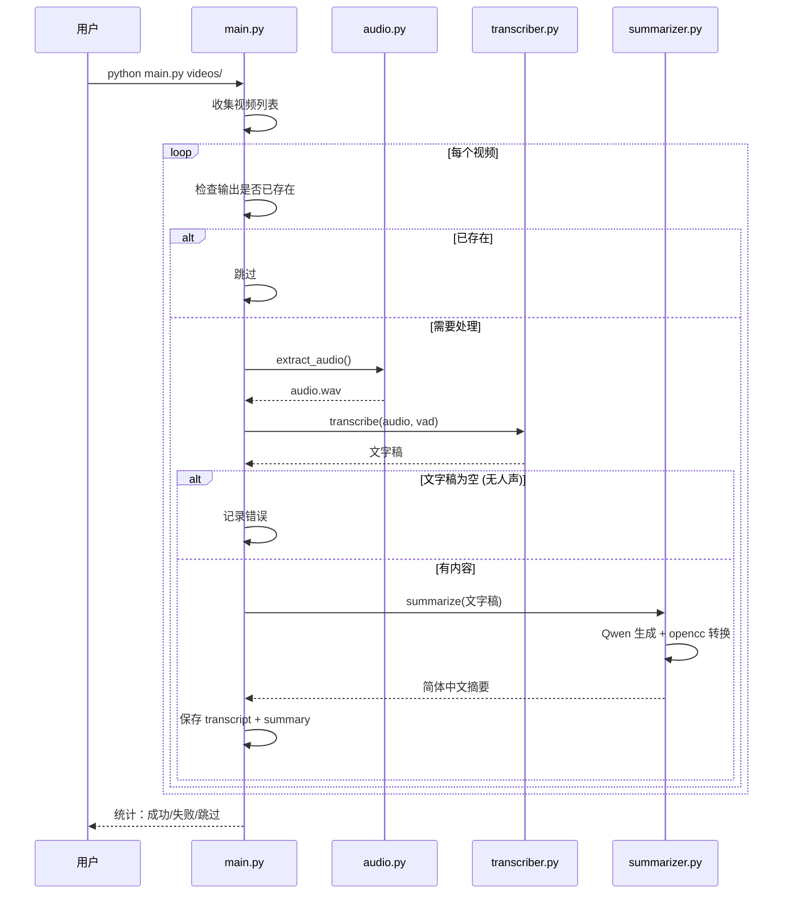

# Video2Text 通俗读本

> 一个把视频变成文字稿和摘要的小工具。本文不止讲它怎么用，还讲它为什么这么做——背后那些"语音识别"、"大模型"、"量化"等等概念到底是什么意思。

## 1. 引子：为什么需要这样一个工具

我们常会遇到这样的场景：一段几十分钟的农业技术视频，你只想知道"它到底讲了什么"。

逐帧观看代价太高。即使是 1.5 倍速，几十个视频累积起来仍然是几十个小时。能不能让计算机帮我们"看"一遍，然后用几百字告诉我们要点？

这就是 Video2Text 想做的事：**视频进，摘要出**。中间它会替你听完整段音频、把语音转成文字、再用大语言模型提炼出结构化要点。

更具体的目标：纯本地运行（不联网、不上传），中文友好，能批量处理一整个目录，支持 GPU 加速。

## 2. 整体思路：三步走

如果让一个人做这件事，他会怎么做？大概是：先把视频里的"声音"分离出来；听完声音，把每句话写下来；最后把这堆文字浓缩成几百字的摘要。

计算机做的事情几乎一样，只是每一步换成了一个专门的工具。



三步分别对应三个非常成熟的技术领域：**音视频处理**、**语音识别 (ASR)**、**自然语言处理 (NLP)**。我们逐一展开。

## 3. 第一步：从视频到音频

### 视频里的"声音"是怎么存的

一个 MP4 文件其实是个"容器"，里面分别封装着视频流（一帧帧画面）和音频流（连续的声波采样）。我们要的只有音频流。

声音的本质是空气压力的波动。计算机存声音，是按固定频率给波形"拍照"——比如每秒 16000 次，每次记一个数字。这个频率叫**采样率**。

### ffmpeg：音视频界的瑞士军刀

[FFmpeg](https://ffmpeg.org/) 诞生于 2000 年，是 Fabrice Bellard（同一个人后来还写了 QEMU 和 TinyCC）发起的项目。它几乎能解码和转换世上所有的音视频格式。

二十多年下来，它已成为行业事实标准——B 站、YouTube、OBS 直播、抖音背后都有 FFmpeg 的身影。我们这里只用了它最基础的一个功能：抽音频。

### 为什么是 16 kHz、单声道

```bash
ffmpeg -i video.mp4 -vn -ar 16000 -ac 1 output.wav
```

`-vn` 丢掉视频；`-ar 16000` 把采样率统一为 16 kHz；`-ac 1` 转成单声道。这几个值不是随意选的，而是因为下一步要喂给 Whisper——它在训练时输入就是 16 kHz 单声道。

人类语音的主要能量集中在 8 kHz 以下。根据奈奎斯特采样定理，16 kHz 已足够无损还原。继续提到 44.1 kHz（CD 音质）只会让文件变大，不会让识别更准。

## 4. 第二步：语音识别 (Whisper)

这一步是整个流程的灵魂，也是过去几十年人工智能领域最艰难的问题之一。我们先快速回顾它的历史。

### 4.1 语音识别简史

**1950s–1980s：声学模板时代。** 早期系统能识别 10 个数字就算成功，靠的是把每个词的频谱"录下来"，新输入和它逐一比对。完全无法处理连续语音和不同口音。

**1980s–2010s：HMM + GMM 时代。** 隐马尔可夫模型 (HMM) 把语音建模为一连串隐藏状态，配合高斯混合模型 (GMM) 描述声学特征。这套方法主导了三十年，IBM、微软、Nuance 的早期产品都基于它。

**2012：深度学习革命。** 微软的研究者把 HMM 中的 GMM 换成了深度神经网络 (DNN)，错误率立刻下降 30%。从此 ASR 进入 DNN 时代，准确率开始持续突破。

**2017：Transformer 改写一切。** Google 那篇《Attention Is All You Need》原本为机器翻译而作，却很快被搬到语音领域。注意力机制能一次性看完整段音频，比 RNN 高效得多。

**2022：Whisper 出场。** OpenAI 用 68 万小时的多语言互联网音频训练了一个 Transformer。它能识别 99 种语言、能直接做翻译和时间戳对齐——而且**完全开源**。

### 4.2 Whisper 是什么

Whisper 的设计极为简洁：编码器读音频，解码器吐文字，中间是标准的 Transformer。但 OpenAI 真正的杀招是数据规模——比当时最大的开源数据集大十倍以上。

它发布了 5 个尺寸：tiny / base / small / medium / large。尺寸越大越准，但也越慢。我们用的是 medium，在准确度和速度之间是个不错的折中。

### 4.3 whisper.cpp：让 Whisper 在普通电脑上跑起来

OpenAI 官方的 Whisper 是 PyTorch 实现，依赖 GPU 显存大、Python 环境复杂。2022 年底，[Georgi Gerganov](https://github.com/ggerganov)（保加利亚的独立开发者）做了一件了不起的事：**用纯 C/C++ 重写了 Whisper 的推理部分**。

这个项目叫 [whisper.cpp](https://github.com/ggerganov/whisper.cpp)。它没有任何 Python、PyTorch 依赖，编译出来就是一个独立的二进制文件，能在 MacBook、树莓派、甚至 iPhone 上跑。

更重要的是，它催生了一个通用张量计算库 GGML——这个库后来成了整个本地 AI 生态的基石（包括下文要讲的 llama.cpp）。

### 4.4 GGML 与量化：把模型"压扁"

神经网络里全是数字，每个权重默认用 32 位浮点数 (FP32) 存。一个 medium 模型有 7.6 亿参数，原始大小约 3 GB。普通电脑的内存吃不消。

**量化 (Quantization)** 的思路是：用更少的位数存这些数字，比如 8 位整数 (INT8) 或 4 位整数 (INT4)。精度有微小损失，但模型体积能缩小 4–8 倍，推理速度也快得多。

我们用的 `ggml-medium-q8_0.bin` 就是 8 位量化版，体积仅 786 MB——比原版小了 4 倍，准确度几乎没有可感知的下降。`q8_0` 中的 `0` 是量化方案代号，表示"对称量化、零点为 0"。

### 4.5 VAD：解决"幻觉"问题

Whisper 有个臭名昭著的毛病——遇到无人声片段（纯音乐、环境噪声、长时间静默），它会"幻觉"出根本不存在的字幕。中文最经典的幻觉就是反复输出"請不吝點贊訂閱轉發⋯⋯"

原因是它的训练数据来自 YouTube，里面充斥着这类频道结尾。模型记住了这种模式，一遇到沉默就脑补一段。

解决办法是在 Whisper 之前加一个 **VAD (Voice Activity Detection)** 模块——专门负责回答一个问题：这段音频里有没有人在说话？没有就跳过。

我们用的是 [Silero VAD](https://github.com/snakers4/silero-vad)，俄罗斯团队开发的轻量神经网络。模型只有 865 KB，但识别人声的准确率非常高。whisper.cpp 1.5+ 已内置支持，加 `--vad` 即可启用。

## 5. 第三步：用大模型生成摘要

转写出来的文字稿可能有几千上万字。要从中提炼"讲了什么"，就需要请大语言模型 (LLM) 出马。这又是另一段精彩的历史。

### 5.1 大模型本地化简史

**2018–2022：闭源王朝。** GPT-2、GPT-3、ChatGPT——这些模型只能通过 API 访问，参数权重从未公开，更别说在本地运行了。普通人想体验大模型只能联网调用。

**2023 年 2 月：LLaMA 泄露。** Meta 开源了 LLaMA-7B（仅供研究用途），权重很快在 4chan 上被泄露。整个开源 AI 社区瞬间被点燃。

**2023 年 3 月：llama.cpp 横空出世。** 还是那位 Georgi Gerganov——他把 whisper.cpp 的经验复用到 LLaMA 上，做出了 [llama.cpp](https://github.com/ggerganov/llama.cpp)。普通笔记本第一次能在本地跑起 70 亿参数的语言模型。

**2023–2024：百花齐放。** Mistral、Qwen、Yi、ChatGLM、DeepSeek 纷纷开源。Llama 2/3 进一步打破授权枷锁。本地大模型从极客玩具变成人人可用的工具。

### 5.2 GGUF：本地大模型的通用语

llama.cpp 早期的模型格式叫 GGML（和 whisper.cpp 共享）。随着支持的模型越来越多，旧格式的限制暴露：扩展字段不够、版本不兼容、元数据混乱。

2023 年 8 月，社区推出了 **GGUF (GPT-Generated Unified Format)**——一个更现代、可扩展、自描述的格式。它现在是本地大模型事实上的标准，HuggingFace 上几乎所有开源模型都有 GGUF 版本。

注意：Whisper 那边用的还是更早的 GGML 格式（因为它够用了）。所以你会同时看到 `ggml-medium-q8_0.bin`（Whisper）和 `qwen3.5-4b-instruct-Q4_K_M.gguf`（LLM）两种后缀。

### 5.3 为什么选 Qwen3.5-4B

**Qwen** 是阿里通义实验室的开源模型系列，对中文支持非常好——这是我们选它的首要原因。LLaMA 系列虽强，但中文能力相对薄弱。

**为什么是 4B 而不是 7B 或 14B？** 因为我们在 RTX 3070 Ti（8 GB 显存）上跑。4B 量化后约 2.6 GB，留出足够显存给 Whisper 和 KV Cache。再大就会爆显存，再小则摘要质量明显下降。

**Q4_K_M 是什么？** 这是一种 4 位量化方案，"K" 表示分组量化（更精细）、"M" 表示中等精度。在 4B 模型上，Q4_K_M 是社区公认的"最佳性价比点"——几乎无可感知的质量损失。

### 5.4 上下文窗口与长文本截断

LLM 一次能"看到"的文字量叫 **上下文窗口 (context window)**，单位是 token（中文里大约 1 个汉字 = 1.5 token）。Qwen3.5 训练时支持 262144 token，但显存有限。

我们设成了 16384 tokens，对应约 1 万汉字。如果转写超过这个长度，会自动从中间截断——避免溢出报错。这是一个权衡：开更大窗口需要更多显存，但能容纳更长的视频。

### 5.5 简繁转换的坑：OpenCC 的来历

Qwen 的训练语料里既有简体也有繁体。生成中文摘要时，它偶尔会冒出几个繁体字（"後"、"裡"、"國"）。对中国大陆用户不友好。

仅靠 prompt 提示"用简体中文输出"并不可靠——LLM 偶尔会忘记。所以我们再加一道保险：用 [OpenCC](https://github.com/BYVoid/OpenCC) 做一次繁→简转换。

OpenCC（Open Chinese Convert）是开源的中文简繁转换库，由 BYVoid 在 2010 年发起。它不只是字对字替换，还能处理"繁体里有，简体没有"的复杂情况（如"頭髮 → 头发"，"發財 → 发财"）。

## 6. 把它们粘起来：架构与流程

理解了每一块技术之后，整个项目的代码结构就很自然了：四个 Python 文件，每个负责一件事。



| 模块 | 职责 |
|------|------|
| `main.py` | 解析命令行参数、收集视频列表、循环处理、保存结果 |
| `audio.py` | 调用 ffmpeg 提取音频（16 kHz 单声道 WAV） |
| `transcriber.py` | 调用 whisper-cli 二进制做语音转写 |
| `summarizer.py` | 加载 Qwen 模型、生成摘要、繁简转换 |

### 完整时序



## 7. 参数选择背后的故事

代码里有一堆魔术数字。不是随便填的——每个都有原因。

### 7.1 LLM 采样参数

```python
temperature=0.7, top_p=0.8, top_k=20,
presence_penalty=1.5, repeat_penalty=1.0
```

LLM 生成文字时是逐 token 采样的。**temperature** 控制随机性：0 完全确定，1 完全随机。0.7 是创造性和稳定性的常见折中。

**top_p** 和 **top_k** 都是"只在最有可能的几个 token 里挑"。Qwen 官方文档推荐 `top_p=0.8, top_k=20`——我们直接照搬。

**presence_penalty=1.5** 是关键。摘要任务里，模型容易陷入复读循环（"主要内容包括...主要内容包括..."）。这个惩罚项让重复出现过的 token 概率下降，有效抑制循环。

### 7.2 VAD 阈值 0.6

`--no-speech-thold 0.6` 表示：当某段音频被判定为"无人声"的概率超过 60%，就跳过。

阈值太低（0.3）会误杀有人声但音量小的片段；太高（0.9）则容忍幻觉。0.6 是 whisper.cpp 社区跑过大量样本后的推荐值。

### 7.3 上下文窗口 16384

`n_ctx=16384` 决定 LLM 一次能看多少文字。8 GB 显存下，这是能稳定运行的上限——再大可能 OOM。

转写超过 10000 字符时自动截断，是为了给 prompt（系统指令 + 摘要要求）留出空间。约 6000 字符的 buffer，正好够。

## 8. 怎么用

### 8.1 安装

需要的东西：

1. Python 3.12+
2. 编译好的 whisper-cli（建议带 CUDA）
3. 三个模型文件，放在 `models/` 目录：
   - `ggml-medium-q8_0.bin`（Whisper，786 MB）
   - `ggml-silero-v5.1.2.bin`（VAD，865 KB）
   - `qwen3.5-4b-instruct-Q4_K_M.gguf`（LLM，2.6 GB）

```bash
uv sync                # 安装 Python 依赖
```

编译 whisper.cpp（带 GPU 加速）：

```bash
git clone https://github.com/ggerganov/whisper.cpp /tmp/whisper.cpp
cd /tmp/whisper.cpp
cmake -B build -DGGML_CUDA=on
cmake --build build -j --config Release
```

### 8.2 命令行用法

```bash
# 处理单个视频
python main.py video.mp4

# 批量处理整个目录
python main.py videos/

# 自定义输出目录 + 详细日志
python main.py videos/ -o my_output -v

# 强制重新处理（覆盖已有结果）
python main.py video.mp4 --force

# 关掉 VAD（仅在确信音频质量好时使用）
python main.py video.mp4 --no-vad
```

### 8.3 输出结构

```
output/
├── video1_transcript.txt        # 文字稿
├── video2_transcript.txt
├── summary/
│   ├── video1_summary.txt       # 摘要
│   └── video2_summary.txt
└── video3_error.log             # 出错时的错误日志
```

文字稿和摘要分开放，是因为很多场景下你只关心摘要。把摘要单独放进 `summary/` 子目录，方便用 `cp output/summary/* somewhere/` 一次性导出。

## 9. 已知限制与未来方向

### 限制

- **仅支持中文**。Whisper 用 `-l zh` 参数锁定中文识别。多语言需要改 transcriber.py。
- **无人声视频会被丢弃**。VAD 太严会误伤；可以用 `--no-vad` 关掉，但要承受幻觉风险。
- **超长转写会截断**。3 小时以上的视频可能丢失尾部内容。解决方案是分段摘要再合并。
- **本地模型体积大**。三个模型加起来约 3.4 GB，首次下载需要耐心。
- **GPU 不是必须，但强烈建议**。CPU 跑 medium 模型大约是 GPU 的 5–10 倍慢。

### 未来可能的方向

- **多语言支持**：自动检测视频语言，切换 Whisper 参数。
- **分段摘要**：长视频先按时间切块，每块单独摘要，最后再合并。
- **断点续传**：批处理过程中断后能从上次位置继续。
- **更多输出格式**：JSON、Markdown、SRT 字幕（带时间戳）。
- **Web UI**：拖一个文件进浏览器就开始处理。
- **替换为更大的模型**：有更多显存时可以换 Qwen3.5-7B 或 14B，摘要质量会更上一层楼。

## 10. 致谢

这个项目站在巨人的肩膀上。值得感谢的开源工作者：

- **Fabrice Bellard** — FFmpeg、QEMU、TinyCC 的作者，独立开发者的传奇。
- **OpenAI Whisper 团队** — 开源了高质量的多语言语音识别模型。
- **Georgi Gerganov** — whisper.cpp、llama.cpp、GGML/GGUF 生态的奠基人。
- **阿里通义实验室** — Qwen 系列开源模型。
- **Silero Team** — 轻量高效的 VAD。
- **BYVoid** — OpenCC，让中文简繁转换"就是能用"。

没有他们，这种"在一台普通电脑上一键搞定视频摘要"的体验是不可能的。
